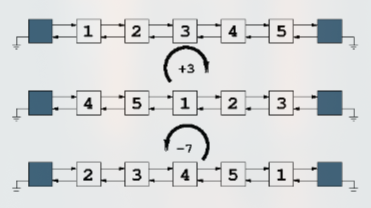

# Parcial 1 - Martes y Jueves

1. Dada la siguiente implementación de nodos doblemente enlazados se pide escribir los métodos InsertAfter e InsertBefore. Indicar el orden de los métodos (3 puntos)

    ```go
      // InsertAfter inserta un nuevo nodo con el dato proporcionado después del nodo actual.
      func (n *Node[T]) InsertAfter(dato T)

      // InsertBefore inserta un nuevo nodo con el dato proporcionado antes del nodo actual.
      func (n *Node[T]) InsertBefore(dato T)
    ```

2. Dada una lista doblemente enlazada, implementada con nodos centinelas y que usa los nodos del ejercicio anterior. Se pide escribir un nuevo método de la lista. Debe ser O(n) (3 puntos).

    ```go
      // Rotar permite rotar los elementos de la lista hacia la derecha o izquierda.
      // Si el número k es negativo, rota a la izquierda; si es positivo, rota a la derecha.
      func (l *List[T]) Rotar(k int)
    ```

    Por ejemplo Rotar(1) implica tomar el elemento de la cabeza y agregarlo a la cola de la lista. Mientras que Rotar(-1) implica tomar el elemento de la cola de la lista y agregarlo a la cabeza. En la siguiente imagen se observan dos rotaciones a derecha y a zquierda.

    

    **Pista:** Se pueden usar los métodos InsertAfter e InsertBefore del ejercicio anterior.

3. Escribir una función recursiva que dibuje un triángulo rectángulo por pantalla usando asteriscos (\*). Donde en la primera línea se imprime 1 asterisco, en la segunda 2, y en la línea n se imprimen n asteriscos. Por ejemplo la llamada Dibujar_Triangulo(5) debería generar la siguiente salida: (2 puntos)

    ```
    *
    **
    ***
    ****
    *****
    ```

4. Supongamos que alguien nos dice que la siguiente función puede encontrar el número más grande de un arreglo en menos de O(n), ya que utiliza la técnica de División y Conquista. El arreglo está desordenado. Se pide probar o refutar la afirmación aplicando el Teorema del Maestro (2 puntos)

    ```go
      func Maximo(arr []int, inicio, fin int) int {
        if inicio == fin {
          return arr[inicio]
        }
        mid := (inicio + fin) / 2
        max := Maximo(arr, inicio, mid)
        for i := mid + 1; i <= fin; i++ {
          if aa[i] > max {
            max = arr[i]
          }
        }
        return max
      }
    ```
